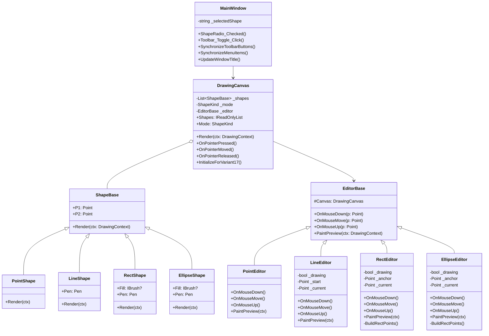

```mermaid
classDiagram
    class DrawingCanvas {
        -List~ShapeBase~ _shapes
        -ShapeKind _mode
        -EditorBase _editor
        +Shapes: IReadOnlyList
        +Mode: ShapeKind
        +Render(ctx: DrawingContext)
        +OnPointerPressed()
        +OnPointerMoved()
        +OnPointerReleased()
        +InitializeForVariant17()
    }

    class EditorBase {
        #Canvas: DrawingCanvas
        +OnMouseDown(p: Point)
        +OnMouseMove(p: Point)
        +OnMouseUp(p: Point)
        +PaintPreview(ctx: DrawingContext)
    }

    class ShapeBase {
        +P1: Point
        +P2: Point
        +Render(ctx: DrawingContext)
    }

    class MainWindow {
        -string _selectedShape
        +ShapeRadio_Checked()
        +Toolbar_Toggle_Click()
        +SynchronizeToolbarButtons()
        +SynchronizeMenuItems()
        +UpdateWindowTitle()
    }

    class PointEditor {
        +OnMouseDown()
        +OnMouseMove()
        +OnMouseUp()
        +PaintPreview(ctx)
    }

    class LineEditor {
        -bool _drawing
        -Point _start
        -Point _current
        +OnMouseDown()
        +OnMouseMove()
        +OnMouseUp()
        +PaintPreview(ctx)
    }

    class RectEditor {
        -bool _drawing
        -Point _anchor
        -Point _current
        +OnMouseDown()
        +OnMouseMove()
        +OnMouseUp()
        +PaintPreview(ctx)
        -BuildRectPoints()
    }

    class EllipseEditor {
        -bool _drawing
        -Point _anchor
        -Point _current
        +OnMouseDown()
        +OnMouseMove()
        +OnMouseUp()
        +PaintPreview(ctx)
        -BuildRectPoints()
    }

    class PointShape {
        +Render(ctx)
    }

    class LineShape {
        +Pen: Pen
        +Render(ctx)
    }

    class RectShape {
        +Fill: IBrush?
        +Pen: Pen
        +Render(ctx)
    }

    class EllipseShape {
        +Fill: IBrush?
        +Pen: Pen
        +Render(ctx)
    }

    EditorBase <|-- PointEditor
    EditorBase <|-- LineEditor
    EditorBase <|-- RectEditor
    EditorBase <|-- EllipseEditor

    ShapeBase <|-- PointShape
    ShapeBase <|-- LineShape
    ShapeBase <|-- RectShape
    ShapeBase <|-- EllipseShape

    DrawingCanvas o-- ShapeBase
    DrawingCanvas --> EditorBase
    MainWindow --> DrawingCanvas
```