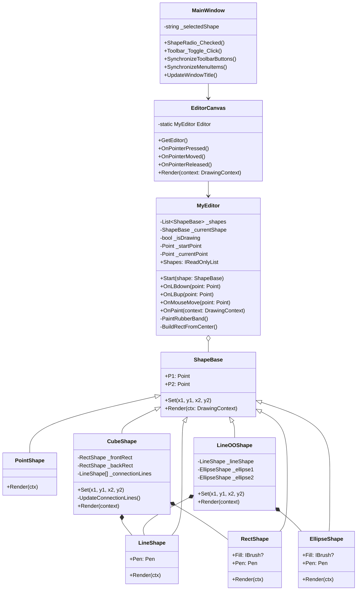

```mermaid
classDiagram
    class MyEditor {
        -List~ShapeBase~ _shapes
        -ShapeBase _currentShape
        -bool _isDrawing
        -Point _startPoint
        -Point _currentPoint
        +Shapes: IReadOnlyList
        +Start(shape: ShapeBase)
        +OnLBdown(point: Point)
        +OnLBup(point: Point)
        +OnMouseMove(point: Point)
        +OnPaint(context: DrawingContext)
        -PaintRubberBand()
        -BuildRectFromCenter()
    }

    class EditorCanvas {
        -static MyEditor Editor
        +GetEditor()
        +OnPointerPressed()
        +OnPointerMoved()
        +OnPointerReleased()
        +Render(context: DrawingContext)
    }

    class ShapeBase {
        +P1: Point
        +P2: Point
        +Set(x1, y1, x2, y2)
        +Render(ctx: DrawingContext)
    }

    class MainWindow {
        -string _selectedShape
        +ShapeRadio_Checked()
        +Toolbar_Toggle_Click()
        +SynchronizeToolbarButtons()
        +SynchronizeMenuItems()
        +UpdateWindowTitle()
    }

    class PointShape {
        +Render(ctx)
    }

    class LineShape {
        +Pen: Pen
        +Render(ctx)
    }

    class RectShape {
        +Fill: IBrush?
        +Pen: Pen
        +Render(ctx)
    }

    class EllipseShape {
        +Fill: IBrush?
        +Pen: Pen
        +Render(ctx)
    }

    class LineOOShape {
        -LineShape _lineShape
        -EllipseShape _ellipse1
        -EllipseShape _ellipse2
        +Set(x1, y1, x2, y2)
        +Render(context)
    }

    class CubeShape {
        -RectShape _frontRect
        -RectShape _backRect
        -LineShape[] _connectionLines
        +Set(x1, y1, x2, y2)
        -UpdateConnectionLines()
        +Render(context)
    }

    ShapeBase <|-- PointShape
    ShapeBase <|-- LineShape
    ShapeBase <|-- RectShape
    ShapeBase <|-- EllipseShape
    ShapeBase <|-- LineOOShape
    ShapeBase <|-- CubeShape

    LineOOShape *-- LineShape
    LineOOShape *-- EllipseShape
    CubeShape *-- RectShape
    CubeShape *-- LineShape

    MyEditor o-- ShapeBase
    EditorCanvas --> MyEditor
    MainWindow --> EditorCanvas
```