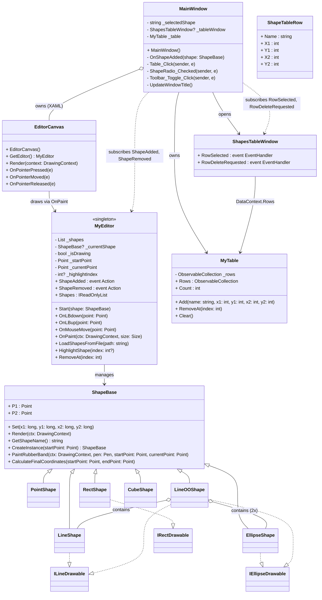

# Lab5 Class Diagram

```mermaid
classDiagram
    direction TB

    class MainWindow {
      - string _selectedShape
      - ShapesTableWindow? _tableWindow
      - MyTable _table
      + MainWindow()
      - OnShapeAdded(shape: ShapeBase)
      - Table_Click(sender, e)
      - ShapeRadio_Checked(sender, e)
      - Toolbar_Toggle_Click(sender, e)
      - UpdateWindowTitle()
    }

    class EditorCanvas {
      + EditorCanvas()
      + GetEditor() MyEditor
      + Render(context: DrawingContext)
      + OnPointerPressed(e)
      + OnPointerMoved(e)
      + OnPointerReleased(e)
    }

    class MyEditor {
      <<singleton>>
      - List<ShapeBase?> _shapes
      - ShapeBase? _currentShape
      - bool _isDrawing
      - Point _startPoint
      - Point _currentPoint
      - int? _highlightIndex
      + ShapeAdded : event Action<ShapeBase>
      + ShapeRemoved : event Action<int>
      + Start(shape: ShapeBase)
      + OnLBdown(point: Point)
      + OnLBup(point: Point)
      + OnMouseMove(point: Point)
      + OnPaint(ctx: DrawingContext, size: Size)
      + LoadShapesFromFile(path: string)
      + HighlightShape(index: int?)
      + RemoveAt(index: int)
      + Shapes : IReadOnlyList<ShapeBase?>
    }

    class ShapesTableWindow {
      + RowSelected : event EventHandler<int?>
      + RowDeleteRequested : event EventHandler<int>
    }

    class MyTable {
      - ObservableCollection<ShapeTableRow> _rows
      + Rows : ObservableCollection<ShapeTableRow>
      + Add(name: string, x1: int, y1: int, x2: int, y2: int)
      + RemoveAt(index: int)
      + Clear()
      + Count : int
    }

    class ShapeTableRow {
      + Name : string
      + X1 : int
      + Y1 : int
      + X2 : int
      + Y2 : int
    }

    class ShapeBase {
      + P1 : Point
      + P2 : Point
      + Set(x1: long, y1: long, x2: long, y2: long)
      + Render(ctx: DrawingContext)
      + GetShapeName() string
      + CreateInstance(startPoint: Point) ShapeBase
      + PaintRubberBand(ctx: DrawingContext, pen: Pen, startPoint: Point, currentPoint: Point)
      + CalculateFinalCoordinates(startPoint: Point, endPoint: Point)
    }

    class PointShape
    class LineShape
    class RectShape
    class EllipseShape
    class LineOOShape
    class CubeShape

    class ILineDrawable
    class IEllipseDrawable
    class IRectDrawable

    %% Inheritance
    ShapeBase <|-- PointShape
    ShapeBase <|-- LineShape
    ShapeBase <|-- RectShape
    ShapeBase <|-- EllipseShape
    ShapeBase <|-- LineOOShape
    ShapeBase <|-- CubeShape

    %% Interface implementation
    LineShape ..|> ILineDrawable
    EllipseShape ..|> IEllipseDrawable
    RectShape ..|> IRectDrawable
    LineOOShape ..|> ILineDrawable
    LineOOShape ..|> IEllipseDrawable

    %% Compositions/Aggregations
    LineOOShape o-- LineShape : contains
    LineOOShape o-- EllipseShape : contains (2x)

    %% Associations/Dependencies
    MainWindow o-- EditorCanvas : owns (XAML)
    MainWindow --> ShapesTableWindow : opens
    MainWindow --> MyTable : owns
    ShapesTableWindow --> MyTable : DataContext.Rows
    MyEditor --> ShapeBase : manages
    EditorCanvas --> MyEditor : draws via OnPaint

    %% Events (conceptual dependencies)
    MainWindow ..> ShapesTableWindow : subscribes RowSelected, RowDeleteRequested
    MainWindow ..> MyEditor : subscribes ShapeAdded, ShapeRemoved
```
